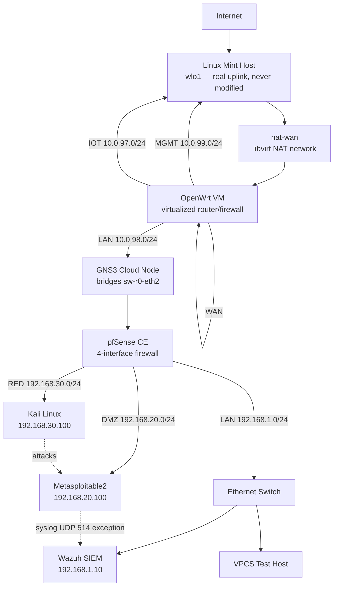

# Architecture

## Network Topology



## IP Addressing Plan

### OpenWrt layer

| Interface | Role | Subnet | Notes |
|---|---|---|---|
| eth0 | WAN | DHCP from `nat-wan` | Internet uplink |
| eth1 | MGMT | 10.0.99.0/24 | Administrative SSH access |
| eth2 | LAN | 10.0.98.0/24 | Bridges into GNS3 via `sw-r0-eth2` |
| eth3 | IOT | 10.0.97.0/24 | Isolated; later repurposed as a second host-bridge point |

### pfSense layer

| Interface | Role | Subnet | Gateway |
|---|---|---|---|
| vtnet0 (WAN) | Uplink through OpenWrt LAN | DHCP from OpenWrt | — |
| vtnet1 (LAN) | Blue Team / SIEM | 192.168.1.0/24 | 192.168.1.1 |
| vtnet2 (OPT1/DMZ) | Vulnerable targets | 192.168.20.0/24 | 192.168.20.1 |
| vtnet3 (OPT2/RED) | Attacker box | 192.168.30.0/24 | 192.168.30.1 |

### Host-side veth access points (Linux Mint)

| Host interface | IP | Reaches |
|---|---|---|
| veth-mgmt-h | 10.0.99.100/24 | OpenWrt MGMT |
| veth-lan-h | 10.0.98.100/24 | OpenWrt LAN |
| veth-iot-h | 192.168.1.50/24 (reassigned) | pfSense LAN, for web GUI access |

All host-side veth interfaces use **static IPs only — never DHCP** — specifically so that no lab interface can ever influence the host's real default route or DNS resolution.

## VM Inventory

| VM | Purpose | OS | Platform |
|---|---|---|---|
| OpenWrt | Router/firewall | OpenWrt 23.05.3 (x86/64) | libvirt/KVM, `virt-install` |
| pfSense | Segmentation firewall | pfSense CE 2.7.2 | GNS3 QEMU VM |
| Kali Linux | Attacker (Red Team) | Kali 2026.1 | GNS3 QEMU VM |
| Metasploitable2 | Vulnerable target (DMZ) | Ubuntu 8.04 Hardy | GNS3 QEMU VM (converted from VMware .vmdk) |
| Wazuh | SIEM / log correlation | Amazon Linux 2 (Wazuh 4.9.2 appliance) | GNS3 QEMU VM (converted from OVA) |

## Firewall Rules (pfSense)

### DMZ tab

| Order | Action | Source | Destination | Protocol | Port | Purpose |
|---|---|---|---|---|---|---|
| 1 | Pass | DMZ subnets | LAN subnets | UDP | 514 | Exception: allow syslog to reach Wazuh |
| 2 | Block | DMZ subnets | LAN subnets | Any | — | Block all other DMZ→LAN traffic |
| 3 | Pass | DMZ subnets | Any | Any | — | Allow DMZ → internet |

### RED tab

| Order | Action | Source | Destination | Protocol | Purpose |
|---|---|---|---|---|---|
| 1 | Block | RED subnets | LAN subnets | Any | RED can never reach Blue Team |
| 2 | Pass | RED subnets | DMZ subnets | Any | RED can attack DMZ — this is the point of the range |
| 3 | Pass | RED subnets | Any | Any | Allow RED → internet |

### LAN tab

Default pfSense wizard-generated rule retained: **Allow LAN to any** (IPv4 and IPv6). This gives Blue Team (on LAN) full visibility into DMZ and RED for monitoring/defense, consistent with the trust model — LAN is the most trusted zone.

## Security Boundaries / Trust Zones

```text
Most trusted ─────────────────────────────────── Least trusted
   MGMT (OpenWrt)  →  LAN (pfSense/Blue)  →  RED (Kali)  →  DMZ (Metasploitable2)
```

- **MGMT** — full administrative trust, SSH access to OpenWrt itself
- **LAN** — Blue Team trust zone; can reach DMZ and RED for monitoring, can reach WAN
- **RED** — semi-trusted; can reach DMZ (by design, to attack it) and WAN, explicitly blocked from LAN
- **DMZ** — least trusted; can only reach WAN, plus the single UDP/514 exception to ship logs to LAN

The DMZ→LAN syslog exception is the one deliberate hole in an otherwise strict deny-by-default model, scoped to exactly one port and justified by an explicit need (centralized logging) rather than left open for convenience.

## Data Flow: Attack → Detection

```text
Kali (RED) ──TCP/various──▶ Metasploitable2 (DMZ)
                                    │
                          local auth/syslog events
                                    │
                    one-line netcat forwarder (UDP/514)
                                    │
                          pfSense (explicit exception rule)
                                    │
                          Wazuh (LAN, 192.168.1.10)
                          ├── Host-based alerts, MITRE ATT&CK tagged
                          └── Suricata IDS (network-layer, LAN-scoped only)
```

**Known gap:** Suricata's capture interface sits on the LAN segment, so it only observes traffic that physically crosses that interface. Direct RED→DMZ attack traffic never touches LAN and is therefore invisible to network-layer IDS today — only the host-based syslog pipeline currently has visibility into attacks against Metasploitable2. See `LESSONS_LEARNED.md` for the planned fix.

